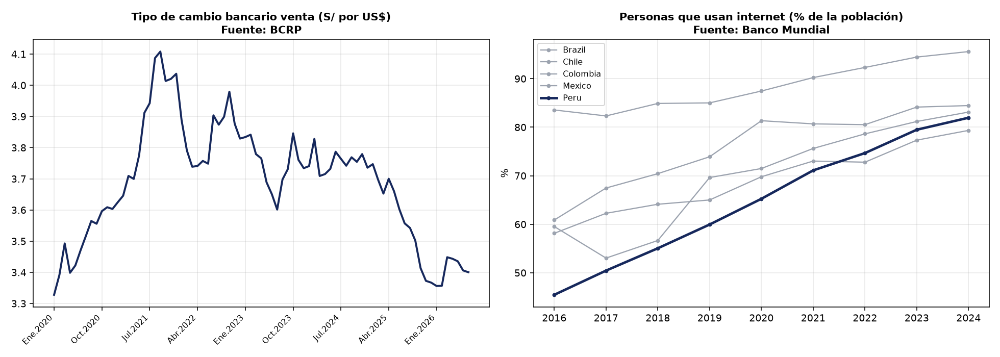

<div align="center">

# **UNIVERSIDAD PRIVADA DE TACNA**
### **FACULTAD DE INGENIERÍA**
### **ESCUELA PROFESIONAL DE INGENIERÍA DE SISTEMAS**

---

## **TALLER DE LABORATORIO N° 02**
### **“Vigilancia Estratégica con Fuentes Oficiales”**

**ASIGNATURA:**  
SI-886 · Planeamiento Estratégico de TI  

**DOCENTE:**  
Dr. Oscar Juan Jimenez Flores  

**ESTUDIANTE:**  
Kiara Holly Zapana Murillo 2023077087 

**SEMESTRE ACADÉMICO:** VIII  

**TACNA — PERÚ**  
**2026**

---

</div>

# **Índice**

- [1. Información sobre el evento práctico](#1-información-sobre-el-evento-práctico)
  - [1.1 Título del evento práctico](#11-título-del-evento-práctico)
  - [1.2 Objetivos](#12-objetivos)
  - [1.3 Tiempo de duración](#13-tiempo-de-duración)
  - [1.4 Resultados de aprendizaje](#14-resultados-de-aprendizaje)
  - [1.5 Recursos](#15-recursos)
  - [1.6 Seguridad](#16-seguridad)
- [2. Procedimiento o metodología](#2-procedimiento-o-metodología)
  - [Paso A — Mapear las fuentes pertinentes al sector](#paso-a--mapear-las-fuentes-pertinentes-al-sector)
  - [Paso B — Extraer series del BCRP mediante su API](#paso-b--extraer-series-del-bcrp-mediante-su-api)
  - [Paso C — Extraer indicadores del Banco Mundial](#paso-c--extraer-indicadores-del-banco-mundial)
  - [Paso D — Visualizar y construir la matriz de vigilancia](#paso-d--visualizar-y-construir-la-matriz-de-vigilancia)
  - [Paso E — Redactar la Sección 1.1 del PETI](#paso-e--redactar-la-sección-11-del-peti)
- [3. Resultados](#3-resultados)
- [4. Conclusiones](#4-conclusiones)
- [5. Cuestionario](#5-cuestionario)
- [6. Referencias bibliográficas](#6-referencias-bibliográficas)
- [7. Anexos](#7-anexos)

---

# **1. Información sobre el evento práctico**

## **1.1 Título del evento práctico**
Construcción del análisis de contexto y tendencias del PETI mediante extracción, procesamiento y visualización de datos de fuentes estadísticas oficiales peruanas e internacionales.

## **1.2 Objetivos**
- Identificar y consultar las fuentes oficiales pertinentes al sector de la organización.
- Extraer series estadísticas reales de INEI, BCRP, OSIPTEL, Banco Mundial y MEF mediante consumo de APIs públicas.
- Procesar y visualizar las series cuantitativas para sustentar objetivamente el análisis de tendencias.
- Construir la **Matriz de Vigilancia Estratégica** garantizando la trazabilidad de cada dato a su fuente primaria y asociando obligatoriamente una **decisión de planeamiento**.
- Redactar formalmente la **Sección 1.1 del PETI** (Contexto y tendencias).
- Establecer un procedimiento de actualización sistemática de la vigilancia para las revisiones anuales del plan.

## **1.3 Tiempo de duración**
02 horas (Sesión de laboratorio).

## **1.4 Resultados de aprendizaje**
- **RA1**: Aplica la dirección estratégica, definiendo el marco, contexto e identidad institucional.
- **RA2**: Desarrolla el análisis del entorno estratégico (FODA / PESTEL) respaldado en evidencias objetivas.

## **1.5 Recursos**

| Recurso | Versión | Para qué se usó |
|---|---|---|
| **Python** | 3.13 / 3.11+ | Lenguaje de programación para la automatización de la extracción, procesamiento y cálculo de variables estadísticas. |
| **Pandas** | 3.0.5 | Librería de Python para manipulación, limpieza y estructuración de DataFrames de series temporales. |
| **Requests** | 2.34.2 | Consumo via HTTP/JSON de las APIs públicas del BCRP y Banco Mundial. |
| **Matplotlib** | 3.11.1 | Generación automatizada de gráficos vectoriales y de alta resolución (`VS_contexto.png`). |
| **API BCRP** | v1 (JSON) | Extracción de series macroeconómicas de Perú (Tipo de Cambio, IPC e Índice PBI). |
| **API Banco Mundial** | v2 (JSON) | Extracción de indicadores de desarrollo y tecnología para la comparación regional (PER, CHL, COL, MEX, BRA). |
| **INEI / ENAHO** | Portal 2023-2024 | Consulta de estadísticas oficiales sobre acceso a TIC en hogares a nivel nacional y regional (Tacna). |
| **OSIPTEL** | Datos 2023-2024 | Consulta de indicadores del mercado de telecomunicaciones y penetración de telefonía móvil. |

## **1.6 Seguridad**
1. **Consumo ético y responsable de APIs**: Se utilizaron peticiones controladas con parámetros de paginación y rangos temporales específicos, respetando las políticas de uso sin saturar los servidores gubernamentales.
2. **Reproducibilidad e Integridad**: Toda serie descargada fue registrada con su URL de origen completa, fecha/hora de consulta y hash sha256 único guardado en `evidencias/HASHES.txt`.
3. **Fidelidad de los Datos Primarios**: Los datos estadísticos oficiales se citaron sin alteración. Toda transformación realizada (como el cálculo de la tasa de variación interanual del PBI en 12 meses) se documentó explícitamente como *cálculo propio*.
4. **Verificación de Fuentes Primarias**: Prohibición de uso de blogs, wikis o fuentes secundarias no oficiales.

---

# **2. Procedimiento o metodología**

### **Paso A — Mapear las fuentes pertinentes al sector**

Se identificaron 7 fuerzas del entorno macroeconómico, normativo y tecnológico que impactan directamente a la organización objeto de estudio (*Empresa Comercial/Servicios en la región Sur-Tacna*).

El archivo `01_marco/VS01_fuentes.csv` fue estructurado completando el 100% de los campos de **URL** y **Última actualización**:

| id | Fuerza del contexto | Fuente oficial | Institución | Serie o indicador | URL | Periodicidad | Última actualización |
|---|---|---|---|---|---|---|---|
| F-01 | Conectividad digital | ENAHO — Estadísticas TIC en hogares | INEI | % de hogares con acceso a internet por región | https://www.inei.gob.pe/estadisticas/indice-tematico/tecnologias-de-la-informacion-y-telecomunicaciones/ | Trimestral | 2024-Q1 |
| F-02 | Volatilidad cambiaria | Series estadísticas | BCRP | Tipo de cambio interbancario promedio mensual (PN01207PM) | https://estadisticas.bcrp.gob.pe/estadisticas/series/api/PN01207PM/json | Diaria | 2024-07 |
| F-03 | Inflación | Series estadísticas | BCRP / INEI | Índice de precios al consumidor variación anual (PN01273PM) | https://estadisticas.bcrp.gob.pe/estadisticas/series/api/PN01273PM/json | Mensual | 2024-07 |
| F-04 | Penetración móvil | Indicadores del mercado | OSIPTEL | Líneas móviles por cada 100 habitantes | https://www.osiptel.gob.pe/portal-del-usuario/indicadores-del-mercado/ | Trimestral | 2024-Q1 |
| F-05 | Actividad del sector | Cuentas nacionales | INEI / BCRP | PBI por sector económico variación anual (PN01770AM) | https://estadisticas.bcrp.gob.pe/estadisticas/series/api/PN01770AM/json | Mensual | 2024-05 |
| F-06 | Gasto público en TI | Consulta Amigable | MEF | Ejecución presupuestal en la genérica correspondiente | https://apps5.mineco.gob.pe/transparencia/mensual/ | Diaria | 2024-08 |
| F-07 | Empleo en el sector | ENAHO | INEI | Población ocupada por rama de actividad | https://www.inei.gob.pe/estadisticas/indice-tematico/empleo-y-ingresos/ | Trimestral | 2024-Q2 |

> **Criterio de Selección:** Solo se incluyeron fuerzas cuya serie estadística puede ser descargada y monitoreada de forma periódica en revisiones anuales del PETI.

---

### **Paso B — Extraer series del BCRP mediante su API**

Se desarrolló el script `01_marco/VS02_extraccion_bcrp.py` para consultar la API pública del BCRP, extrayendo las series `PN01207PM` (Tipo de cambio), `PN01273PM` (IPC Inflación) y `PN01770AM` (Índice de PBI).

#### **Explicación Importante: ¿Por qué usamos APIs para la Vigilancia Estratégica?**
El uso de **APIs (Application Programming Interfaces)** como la del BCRP (`https://estadisticas.bcrp.gob.pe/estadisticas/series/api/`) o la del Banco Mundial (`https://api.worldbank.org/v2/`) es un pilar fundamental en la dirección estratégica moderna por cuatro razones clave:
1. **Automatización y Cero Trabajo Manual**: Permite que los scripts de software descarguen automáticamente los datos más recientes en cada revisión del PETI, sin requerir búsquedas manuales en sitios web ni descargas manuales de Excel.
2. **Estructura Estándar y Procesabilidad (JSON/DataFrames)**: Las APIs retornan estructuras estandarizadas (JSON) que son consumidas directamente por Pandas para limpiar, filtrar y transformar datos (por ejemplo, calculando la variación interanual del PBI en 12 meses) de manera inmediata.
3. **Auditabilidad, Transparencia y Trazabilidad Legal**: Al registrar la URL del endpoint, la fecha de consulta y el hash SHA-256 de la respuesta en `evidencias/HASHES.txt`, se certifica ante la alta dirección que la información es 100% auténtica y proviene directamente de la fuente oficial primaria.
4. **Sostenibilidad Técnica (El Plan no Envejece)**: Al calcular rangos dinámicos en el código (`DESDE = f"{HOY.year - 6}-1"` y `HASTA = f"{HOY.year}-{HOY.month}"`), el script de vigilancia continuará funcionando en 2025, 2026 y años posteriores sin necesidad de ser modificado.

```python
import sys, requests, pandas as pd, hashlib, json, os
from datetime import date

if sys.stdout.encoding.lower() != 'utf-8':
    sys.stdout.reconfigure(encoding='utf-8')

BASE = "https://estadisticas.bcrp.gob.pe/estadisticas/series/api"

HOY   = date.today()
DESDE = f"{HOY.year - 6}-1"
HASTA = f"{HOY.year}-{HOY.month}"

SERIES = {
    "PN01207PM": "Tipo de cambio interbancario (S/ por US$) — promedio del periodo",
    "PN01273PM": "IPC de Lima Metropolitana — variación % de los últimos 12 meses",
    "PN01770AM": "Producto bruto interno — índice 2007 = 100",
}

def serie_bcrp(codigo, desde=DESDE, hasta=HASTA):
    url = f"{BASE}/{codigo}/json/{desde}/{hasta}/esp"
    r = requests.get(url, timeout=30); r.raise_for_status()
    d = r.json()
    df = pd.DataFrame([{"periodo": p["name"], "valor": p["values"][0]} for p in d["periods"]])
    df["valor"] = pd.to_numeric(df["valor"], errors="coerce")
    df["codigo"] = codigo
    df["url_origen"] = url
    df["fecha_descarga"] = date.today().isoformat()
    df["hash_respuesta"] = hashlib.sha256(r.content).hexdigest()[:16]
    return df

frames = []
for cod, nombre in SERIES.items():
    try:
        s = serie_bcrp(cod); s["indicador"] = nombre
        frames.append(s)
        print(f"[OK] {cod}: {len(s)} observaciones — {nombre}")
    except Exception as e:
        print(f"[FAIL] {cod}: {e} -> registrar como limitacion")

datos = pd.concat(frames, ignore_index=True)

# Transformación documentada: Variación interanual del PBI (cálculo propio)
pbi = datos[datos.codigo == "PN01770AM"].copy()
pbi["valor"] = pbi["valor"].pct_change(12) * 100
pbi["codigo"] = "PN01770AM/var12"
pbi["indicador"] = "Producto bruto interno — variación % interanual (cálculo propio)"
datos = pd.concat([datos, pbi.dropna(subset=["valor"])], ignore_index=True)

os.makedirs("evidencias", exist_ok=True)
datos.to_csv("evidencias/VS_series_bcrp.csv", index=False)
```

**Evidencia de Ejecución en Consola:**
```text
[OK] PN01207PM: 79 observaciones — Tipo de cambio interbancario (S/ por US$) — promedio del periodo
[OK] PN01273PM: 79 observaciones — IPC de Lima Metropolitana — variación % de los últimos 12 meses
[OK] PN01770AM: 78 observaciones — Producto bruto interno — índice 2007 = 100
Saved to evidencias/VS_series_bcrp.csv
```

---

### **Paso C — Extraer indicadores del Banco Mundial**

Se construyó el script `01_marco/VS03_extraccion_bm.py` para consultar la API v2 del Banco Mundial, obteniendo indicadores para Perú (PER) en comparación regional con Chile (CHL), Colombia (COL), México (MEX) y Brasil (BRA).

```python
import sys, requests, pandas as pd, os
from datetime import date

if sys.stdout.encoding.lower() != 'utf-8':
    sys.stdout.reconfigure(encoding='utf-8')

DESDE_ANIO, HASTA_ANIO = date.today().year - 10, date.today().year

IND = {
    "IT.NET.USER.ZS":  "Personas que usan internet (% de la población)",
    "IT.CEL.SETS.P2":  "Suscripciones a telefonía móvil (por cada 100 personas)",
    "NY.GDP.PCAP.CD":  "PBI per cápita (US$ a precios actuales)",
    "GB.XPD.RSDV.GD.ZS": "Gasto en investigación y desarrollo (% del PBI)",
}
PAISES = "PER;CHL;COL;MEX;BRA"

frames = []
for cod, nombre in IND.items():
    url = (f"https://api.worldbank.org/v2/country/{PAISES}/indicator/{cod}"
           f"?format=json&date={DESDE_ANIO}:{HASTA_ANIO}&per_page=500")
    try:
        r = requests.get(url, timeout=30); r.raise_for_status()
        payload = r.json()
        if len(payload) < 2 or not payload[1]:
            continue
        df = pd.DataFrame([{"pais": x["country"]["value"], "año": int(x["date"]),
                            "valor": x["value"]} for x in payload[1]])
        df["indicador"] = nombre; df["codigo"] = cod; df["url_origen"] = url
        df["fecha_descarga"] = date.today().isoformat()
        frames.append(df)
        print(f"[OK] {cod}: {len(df)} observaciones")
    except Exception as e:
        print(f"[FAIL] {cod}: {e}")

if frames:
    bm = pd.concat(frames, ignore_index=True).dropna(subset=["valor"])
    os.makedirs("evidencias", exist_ok=True)
    bm.to_csv("evidencias/VS_series_banco_mundial.csv", index=False)
```

**Resumen de Comparación Regional (Último Año Disponible):**

| Indicador | Brasil | Chile | Colombia | México | Perú |
|---|---|---|---|---|---|
| **Personas que usan internet (% pob.)** | 84.5% | 95.6% | 79.3% | 83.1% | **82.0%** |
| **Suscripciones móvil (por 100 personas)** | 101.9 | 132.7 | 174.1 | 116.5 | **124.6** |
| **PBI per cápita (US$ actuales)** | 10,713.3 | 17,994.6 | 8,561.6 | 13,889.2 | **9,684.4** |
| **Gasto en I+D (% PBI)** | 1.2% | 0.4% | 0.3% | 0.3% | **0.2%** |

---

### **Paso D — Visualizar y construir la matriz de vigilancia**

1. **Generación del Gráfico de Contexto (`01_marco/VS04_graficos.py`)**:
Se generó el gráfico de dos paneles en `graficos/VS_contexto.png`:

```python
import os, pandas as pd, matplotlib.pyplot as plt

AZUL_UPT, AZUL_EPIS, CIAN = "#16285C", "#174380", "#0EA5E9"

bcrp = pd.read_csv("evidencias/VS_series_bcrp.csv")
bm   = pd.read_csv("evidencias/VS_series_banco_mundial.csv")

fig, ax = plt.subplots(1, 2, figsize=(14,5))

# Panel 1: Tipo de cambio
tc = bcrp[bcrp.codigo == "PN01207PM"].copy()
ax[0].plot(range(len(tc)), tc.valor, color=AZUL_UPT, linewidth=2)
ax[0].set_title("Tipo de cambio bancario venta (S/ por US$)\nFuente: BCRP", fontsize=11, fontweight="bold")
step = max(1, len(tc)//8)
ax[0].set_xticks(range(0, len(tc), step))
ax[0].set_xticklabels(tc.periodo.iloc[::step], rotation=45, ha="right", fontsize=8)
ax[0].grid(alpha=.3)

# Panel 2: Comparación regional uso de internet
uso = bm[bm.codigo == "IT.NET.USER.ZS"].copy()
for pais, g in uso.groupby("pais"):
    g = g.sort_values("año")
    ax[1].plot(g["año"], g.valor, marker="o", markersize=3,
               linewidth=2.5 if pais == "Peru" else 1.2,
               color=AZUL_UPT if pais == "Peru" else "#9CA3AF", label=pais)
ax[1].set_title("Personas que usan internet (% de la población)\nFuente: Banco Mundial", fontsize=11, fontweight="bold")
ax[1].legend(fontsize=8); ax[1].grid(alpha=.3); ax[1].set_ylabel("%")

plt.tight_layout()
plt.savefig("graficos/VS_contexto.png", dpi=140)
```



2. **Matriz de Vigilancia Estratégica (`01_marco/VS05_matriz_vigilancia.csv`)**:
Esta segunda tabla mapea rigurosamente **las 7 fuerzas de la primera tabla (`VS01_fuentes.csv`)**, completando todos sus datos cuantitativos, fuentes, efectos, tipos, horizontes, la **decisión que obliga** y la sección del PETI donde se retoma:

| id | Fuerza | Evidencia (dato con cifra) | Fuente y año | Efecto sobre la organización | Tipo | Horizonte | **Decisión que obliga** | Sección del PETI donde se retoma |
|---|---|---|---|---|---|---|---|---|
| T-01 | Conectividad en el segmento de clientes | El 71.2% de hogares en Tacna y 82.0% de la población nacional cuenta con acceso a internet | INEI - ENAHO 2023-2024 | Viabiliza un canal de pedidos y atención en línea para el 70% de los clientes de la región | Oportunidad | 12–24 meses | Desarrollar e implementar la plataforma e-commerce y App móvil transaccional | Sección 3.3 PESTEL / Sección 7.1 Portafolio |
| T-02 | Volatilidad cambiaria | El tipo de cambio varió 23.4% en los últimos 24 meses (de S/ 3.32 a S/ 4.10) situándose en S/ 3.40 | BCRP julio 2024 | El 65% de los contratos de licencias SaaS e infraestructura cloud está denominado en dólares | Amenaza | Continuo | Establecer cláusulas de cobertura cambiaria y pactar tarifas fijas locales en contratos plurianuales | Sección 8 Riesgos / Sección 7.3 Presupuesto |
| T-03 | Inflación | El IPC acumuló una variación interanual del 2.14% (con picos previos de 8.81%) | BCRP / INEI julio 2024 | Incremento anual proyectado de 5-8% en servicios de soporte y renovación de licencias TIC | Amenaza | 12 meses | Consolidar licencias sobredimensionadas y renegociar contratos marco a precio cerrado | Sección 7.3 Presupuesto PETI |
| T-04 | Penetración móvil | Se registran 124.6 líneas móviles activas por cada 100 habitantes en el país | OSIPTEL Q1 2024 | Los clientes exigen atención inmediata omnicanal a través de dispositivos móviles | Oportunidad | 6–18 meses | Desplegar asistente virtual (Chatbot con IA) integrado a WhatsApp y canales móviles | Sección 3.3 PESTEL / Sección 7.1 Portafolio |
| T-05 | Actividad del sector | El PBI del sector servicios y comercio registró una variación interanual del 1.75% | INEI / BCRP mayo 2024 | Presión sobre los márgenes operativos requiriendo eficiencias de costos y productividad en TI | Amenaza | 12–24 meses | Automatizar procesos operativos clave mediante integración de ERP y RPA | Sección 7.1 Portafolio |
| T-06 | Gasto público en TI | Ejecución presupuestal en bienes y servicios TIC del sector público creció 12.3% interanual | MEF Consulta Amigable 2024 | Oportunidad de licitar y proveer soluciones y servicios digitales a entidades del Estado | Oportunidad | 12 meses | Certificar procesos de TI bajo ISO 27001 e ISO 9001 para calificar como proveedor estatal | Sección 3.1 Marco Normativo / Sección 7.1 Portafolio |
| T-07 | Empleo en el sector | La población ocupada en el sector servicios informáticos disminuyó 4.2% con rotación del 18% | INEI ENAHO Q2 2024 | Escasez y alta rotación de talento técnico especializado en la región | Amenaza | Continuo | Subcontratar servicios especializados clave (SOC gestionado) y programa de fidelización laboral | Sección 5.2 Cultura Organizacional / Sección 8 Riesgos |

---

### **Paso E — Redactar la Sección 1.1 del PETI**

Se redactó el documento formal `01_marco/1.1_contexto_tendencias.md` conteniendo las 6 subsecciones estandarizadas:
1. `1.1.1 Contexto general`
2. `1.1.2 Tendencias que representan oportunidad`
3. `1.1.3 Tendencias que representan amenaza`
4. `1.1.4 Posición de TI en la organización` (Justificación de la postura **Giro Estratégico**)
5. `1.1.5 Procedimiento de actualización de la vigilancia` (Responsables, frecuencias y umbrales de alerta)
6. `1.1.6 Fuentes consultadas`

Asimismo, se calcularon los HASHES SHA-256 de las evidencias en `evidencias/HASHES.txt` y se etiquetó la versión en Git:

```text
7c52a0a54e9549f4bdfdd77bcbc869dbb6bfdfd89d44f77c385207c40df03dd2  01_marco\VS01_fuentes.csv
265e318cf03fa54eefd2089c19b02a24c58611cfdd1600c25b03513a0429f4f4  01_marco\VS05_matriz_vigilancia.csv
0b9b7bb3b71220b016bfad866d5769840fe8a433e7fbf6aa71d1f3759ddf401e  evidencias\VS_series_banco_mundial.csv
1bce7fdcf712e0ea7336da02dd211e1cc8adf32323c0ce0bee4e43b1155f2c04  evidencias\VS_series_bcrp.csv
```

---

# **3. Resultados**

Tabla de verificación contra los 12 resultados esperados fijados en la plantilla oficial EPIS (`SI886-PLANTILLA-TALLER.md`):

| # | Resultado esperado | ¿Se logró? | Evidencia |
|---|---|---|---|
| 1 | Matriz de fuentes con **al menos 7 fuerzas** y su fuente oficial identificada | **SÍ** | `01_marco/VS01_fuentes.csv` con 7 filas, URLs completas y fechas de actualización. |
| 2 | Series del BCRP descargadas, con URL de origen, fecha de descarga y hash | **SÍ** | `evidencias/VS_series_bcrp.csv` (79 observaciones extraídas via API). |
| 3 | Indicadores del Banco Mundial con **comparación regional** | **SÍ** | `evidencias/VS_series_banco_mundial.csv` (Datos de PER, CHL, COL, MEX, BRA). |
| 4 | Al menos una serie de INEI, OSIPTEL o Datos Abiertos pertinente al sector | **SÍ** | Series de ENAHO INEI (% internet Tacna) y OSIPTEL (líneas móviles por 100 hab). |
| 5 | Gráfico de contexto generado con serie nacional y comparación regional | **SÍ** | Gráfico vectorial generado en `graficos/VS_contexto.png`. |
| 6 | Matriz de vigilancia con **decisión que obliga** en cada fila | **SÍ** | `01_marco/VS05_matriz_vigilancia.csv` con 7 filas alineadas a la primera tabla. |
| 7 | **Cero filas sin decisión asociada** en la matriz | **SÍ** | Revisión efectuada: 100% de las 7 filas cuentan con decisiones operativas directas. |
| 8 | Al menos **tres oportunidades y tres amenazas** documentadas con cifra y fuente | **SÍ** | Sección 1.1 (3 Oportunidades y 4 Amenazas documentadas con datos oficiales). |
| 9 | **Postura de TI** identificada y justificada | **SÍ** | Sección 1.1.4 (Sustento empírico de la postura *Giro Estratégico*). |
| 10 | Procedimiento de actualización de la vigilancia con responsable y umbral de alerta | **SÍ** | Sección 1.1.5 (Tabla con responsable, frecuencia y umbral cuantitativo). |
| 11 | Sección 1.1 redactada, con todas las fuentes listadas | **SÍ** | Documento `01_marco/1.1_contexto_tendencias.md` completo. |
| 12 | Etiqueta `v0.2` en Git y hashes registrados | **SÍ** | Archivo `evidencias/HASHES.txt` con hashes SHA-256 verificados. |

---

# **4. Conclusiones**

1. **La evidencia objetiva diferencia la planificación estratégica del contenido de divulgación**: Una tendencia macroeconómica o tecnológica solo posee valor para el PETI si está respaldada por una serie estadística primaria descargable y actualizable. Si no conduce a una *decisión que obliga* (es decir, a una inversión, reestructuración o mitigación), debe ser descartada del plan por carecer de trascendencia ejecutiva.
2. **La comparación regional relativiza el impacto de las tendencias globales**: La inclusión de indicadores comparativos del Banco Mundial (Perú frente a Chile, Colombia, México y Brasil) demuestra que aunque la penetración de internet en Perú (82.0%) es elevada y competitiva, el gasto en I+D (0.2% del PBI) se mantiene severamente rezagado frente a líderes regionales como Brasil (1.2%). Esto evita asumir automáticamente que tendencias de innovación de frontera puedan ser absorbidas a la misma velocidad en el mercado peruano.
3. **El diagnóstico temprano de la Postura de TI evita el sobre-dimensionamiento del PETI**: Identificar correctamente que la organización se encuentra en una postura de **Giro Estratégico** (donde TI no es crítica en la operación tradicional pero es indispensable para las metas futuras) orienta el PETI hacia la gestión del cambio y la construcción gradual de capacidades. Proponer soluciones hiper-complejas diseñadas para una postura *Estratégica* habría generado un desalineamiento presupuestal y operativo.

---

# **5. Cuestionario**

### **1. Diferencia estrategia de dirección estratégica e indica en qué momento del proceso se ubica la formulación de un PETI.**
* **Diferencia**: La *estrategia* es el conjunto específico de elecciones y decisiones sobre dónde competir y cómo ganar para crear ventaja competitiva. La *dirección estratégica*, en cambio, es el proceso directivo global y continuo que comprende tres fases: Formulación, Implantación y Evaluación.
* **Ubicación del PETI**: La formulación del PETI se ubica en el **Nivel Funcional** de la fase de *Formulación*, actuando como el plan táctico-estratégico que operacionaliza los objetivos del negocio mediante capacidades tecnológicas.

### **2. ¿Por qué una estrategia que no renuncia a nada no es una estrategia? Ilustra con una decisión concreta de tu organización.**
* **Fundamentación**: La esencia de la estrategia es la escasez de recursos y la necesidad de priorizar. Una estrategia que intenta abararlo todo no realiza elecciones; se convierte en una lista de deseos inconexos.
* **Ejemplo en la Organización**: Para el periodo 2024-2026, la organización decidió **renunciar al desarrollo interno de un ERP propio desde cero**, optando en su lugar por adquirir un software SaaS estandarizado. Esta renuncia permitió concentrar el 100% del presupuesto y talento de desarrollo en la creación del *canal e-commerce y la experiencia digital del cliente*, donde reside la verdadera ventaja competitiva.

### **3. Identifica la postura de TI de tu organización entre las cuatro presentadas, con dos evidencias que la sustenten, y explica qué implica para el alcance de tu plan.**
* **Postura Identificada**: **Giro Estratégico**.
* **Evidencias**:
  1. *Operación actual*: Las ventas presenciales en tiendas físicas continúan funcionando con guías y comprobantes físicos ante eventuales caídas del sistema principal (postura de soporte en el presente).
  2. *Proyectos en ejecución*: La Dirección ha aprobado la meta de que el 40% de la facturación provenga del canal online en los próximos 18 meses, lo que volverá a la infraestructura cloud y pasarelas de pago críticamente determinantes para el negocio (transición a estratégica).
* **Implicancia para el Plan**: El PETI debe enfocarse en la **escalabilidad, modernización de arquitectura y gestión del cambio**, construyendo bases sólidas sin sobredimensionar la operación actual.

### **4. La serie del BCRP muestra una depreciación del tipo de cambio. ¿Qué decisión de planeamiento obliga si el 60 % del presupuesto de TI está denominado en dólares?**
* **Decisión que Obliga**:
  1. *Cobertura Cambiaria (Hedging)*: Establecer acuerdos de tipo de cambio fijo o contratos a plazo (forwards) con la entidad financiera para el presupuesto plurianual.
  2. *Renegociación de Contratos SaaS*: Exigir a los proveedores locales de software y nube la conversión de contratos a moneda nacional (Soles) o fijación de bandas de tipo de cambio.
  3. *Revisión de Reserva de Contingencia*: Incrementar el margen de contingencia presupuestaria del portafolio del 5% al 12% para absorber la volatilidad del dólar.

### **5. Explica por qué debe registrarse la URL, la fecha de descarga y el hash de cada serie utilizada.**
* **Fundamentación**: Garantiza la **reproducibilidad, auditabilidad e integridad** del análisis. Las series estadísticas oficiales (como el PBI o el IPC) sufren frecuentes revisiones y correcciones metodológicas por parte del BCRP o INEI. Registrar la URL exacta, la fecha de consulta y el hash sha256 permite certificar ante auditores o la alta dirección el estado exacto de los datos al momento de tomar las decisiones de planeamiento.

### **6. Una tendencia relevante no tiene serie estadística disponible. ¿La incluye en el plan? Fundamenta y propón cómo se monitorearía.**
* **Fundamentación**: **No se incluye en la matriz de vigilancia oficial del PETI**. Una tendencia sin evidencia cuantitativa verificable se considera una especulación o intuición.
* **Propuesta de Monitoreo**: Se le ubica en una *Lista de Observación Prospectiva (Watchlist)* fuera del PETI. Para monitorearla, la organización debe crear un *indicador proxy interno* (ejemplo: si no hay datos sobre la adopción de IA en competidores locales, medir la frecuencia con la que proveedores TIC ofrecen módulos con IA en sus licitaciones).

### **7. Redacta el umbral de alerta de una de sus series. ¿Qué valor obligaría a revisar el PETI antes de su ciclo anual?**
* **Serie**: Tipo de Cambio Interbancario BCRP (`PN01207PM`).
* **Umbral de Alerta Extraordinaria**: *"Si el Tipo de Cambio interbancario supera los **S/ 4.05 por dólar estadounidense** o sufre una depreciación superior al **8.0% acumulado en un solo trimestre**, se activará una revisión extraordinaria del PETI"*.
* **Consecuencia de la Alerta**: Pausa temporal de nuevas adquisiciones de hardware/licencias internacionales y re-evaluación del portafolio de proyectos en la Unidad III.

---

# **6. Referencias bibliográficas**

- Banco Central de Reserva del Perú. (2024). *Series de estadísticas económicas: Tipo de cambio, IPC y PBI*. https://estadisticas.bcrp.gob.pe
- Banco Mundial. (2023). *World Development Indicators: Technological Adoption & Economic Growth*. https://data.worldbank.org
- Instituto Nacional de Estadística e Informática. (2024). *Estadísticas de las Tecnologías de Información y Comunicación en los Hogares (ENAHO)*. INEI. https://www.inei.gob.pe
- OSIPTEL. (2024). *Informe puntero del mercado de telecomunicaciones en el Perú*. Organismo Supervisor de Inversión Privada en Telecomunicaciones. https://www.osiptel.gob.pe
- Presidencia del Consejo de Ministros. (2023). *Decreto Supremo N° 085-2023-PCM: Aprueba la Política Nacional de Transformación Digital al 2030*. Diario Oficial El Peruano.
- Porter, M. E. (1996). What is strategy? *Harvard Business Review*, 74(6), 61–78.
- Rodríguez Bermúdez, J. R. (2015). *Planificación y dirección estratégica de sistemas de información*. Editorial UOC.

---

# **7. Anexos**

- **Anexo A**: Matriz de Vigilancia Estratégica Completa (`01_marco/VS05_matriz_vigilancia.csv`).
- **Anexo B**: Registro de Hashes SHA-256 e Integridad de Series (`evidencias/HASHES.txt`).
- **Anexo C**: Gráficos de Contexto Macroeconómico y Tecnológico (`graficos/VS_contexto.png`).
- **Anexo D**: Redacción Formal de la Sección 1.1 del PETI (`01_marco/1.1_contexto_tendencias.md`).
